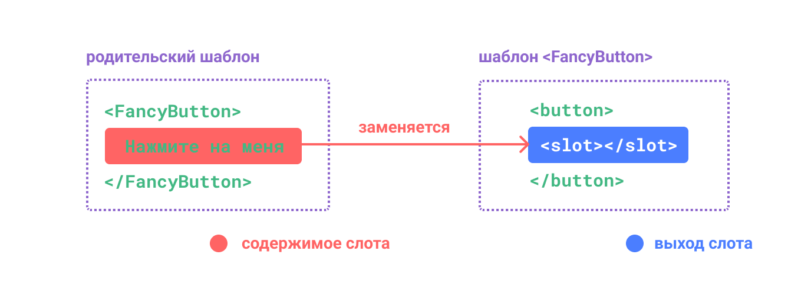
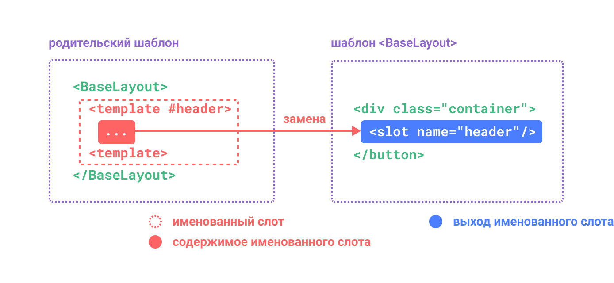
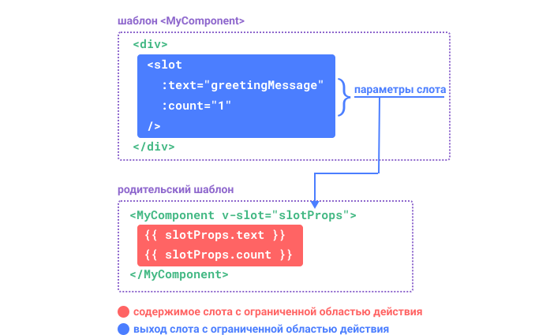

# Слоты {#slots}

> Эта страница предполагает, что вы уже прочитали [Основы компонентов](/guide/essentials/component-basics).

<VueSchoolLink href="https://vueschool.io/lessons/vue-3-component-slots" title="Бесплатный урок по слотам Vue.js"/>

## Содержимое и выход слота {#slot-content-and-outlet}

Мы узнали, что компоненты могут принимать параметры, которые могут быть JavaScript-значениями любого типа. Но как насчёт содержания шаблонов? В некоторых случаях мы можем захотеть передать фрагмент шаблона дочернему компоненту и позволить ему отрисовать этот фрагмент в своем собственном шаблоне.

Например, у нас может быть компонент `<FancyButton>`, который поддерживает следующее использование:

```vue-html{2}
<FancyButton>
  Нажмите на меня! <!-- содержимое слота -->
</FancyButton>
```

Шаблон `<FancyButton>` выглядит следующим образом:

```vue-html{2}
<button class="fancy-btn">
  <slot></slot> <!-- выход слота -->
</button>
```

Элемент `<slot>` — это **выход слота**, который указывает, куда должно быть выведено содержимое **слота**, предоставленное родителем.



<!-- https://www.figma.com/file/LjKTYVL97Ck6TEmBbstavX/slot -->

И финальный рендер DOM:

```html
<button class="fancy-btn">Нажмите на меня!</button>
```

<div class="composition-api">

[Попробовать в Песочнице](https://play.vuejs.org/#eNpdUdlqAyEU/ZVbQ0kLMdNsXabTQFvoV8yLcRkkjopLSQj596oTwqRvnuM9y9UT+rR2/hs5qlHjqZM2gOch2m2rZW+NC/BDND1+xRCMBuFMD9N5NeKyeNrqphrUSZdA4L1VJPCEAJrRdCEAvpWke+g5NHcYg1cmADU6cB0A4zzThmYckqimupqiGfpXILe/zdwNhaki3n+0SOR5vAu6ReU++efUajtqYGJQ/FIg5w8Wt9FlOx+OKh/nV1c4ZVNqlHE1TIQQ7xnvCN13zkTNalBSc+Jw5wiTac2H1WLDeDeDyXrJVm9LWG7uE3hev3AhHge1cYwnO200L4QljEnd1bCxB1g82UNhe+I6qQs5kuGcE30NrxeaRudzOWtkemeXuHP5tLIKOv8BN+mw3w==)

</div>
<div class="options-api">

[Попробовать в Песочнице](https://play.vuejs.org/#eNpdUdtOwzAM/RUThAbSurIbl1ImARJf0ZesSapoqROlKdo07d9x0jF1SHmIT+xzcY7sw7nZTy9Zwcqu9tqFTYW6ddYH+OZYHz77ECyC8raFySwfYXFsUiFAhXKfBoRUvDcBjhGtLbGgxNAVcLziOlVIp8wvelQE2TrDg6QKoBx1JwDgy+h6B62E8ibLoDM2kAAGoocsiz1VKMfmCCrzCymbsn/GY95rze1grja8694rpmJ/tg1YsfRO/FE134wc2D4YeTYQ9QeKa+mUrgsHE6+zC+vfjoz1Bdwqpd5iveX1rvG2R1GA0Si5zxrPhaaY98v5WshmCrerhVi+LmCxvqPiafUslXoYpq0XkuiQ1p4Ax4XQ2BSwdnuYP7p9QlvuG40JHI1lUaenv3o5w3Xvu2jOWU179oQNn5aisNMvLBvDOg==)

</div>

С помощью слотов `<FancyButton>` отвечает за отрисовку внешней `<кнопки>` (и её причудливой стилизации), в то время как внутреннее содержимое предоставляется родительским компонентом.

Другой способ понять слоты — сравнить их с функциями JavaScript:

```js
// родительский компонент, передающий содержимое слота
FancyButton('Нажмите на меня!')

// FancyButton отображает содержимое слота в собственном шаблоне
function FancyButton(slotContent) {
  return `<button class="fancy-btn">
      ${slotContent}
    </button>`
}
```

Содержание слотов не ограничивается только текстом. Это может быть любое содержимое шаблона. Например, мы можем передавать несколько элементов или даже другие компоненты:

```vue-html
<FancyButton>
  <span style="color:red">Нажмите на меня!</span>
  <AwesomeIcon name="plus" />
</FancyButton>
```

<div class="composition-api">

[Попробовать в Песочнице](https://play.vuejs.org/#eNp1UmtOwkAQvspQYtCEgrx81EqCJibeoX+W7bRZaHc3+1AI4QyewH8ewvN4Aa/gbgtNIfFf5+vMfI/ZXbCQcvBmMYiCWFPFpAGNxsp5wlkphTLwQjjdPlljBIdMiRJ6g2EL88O9pnnxjlqU+EpbzS3s0BwPaypH4gqDpSyIQVcBxK3VFQDwXDC6hhJdlZi4zf3fRKwl4aDNtsDHJKCiECqiW8KTYH5c1gEnwnUdJ9rCh/XeM6Z42AgN+sFZAj6+Ux/LOjFaEK2diMz3h0vjNfj/zokuhPFU3lTdfcpShVOZcJ+DZgHs/HxtCrpZlj34eknoOlfC8jSCgnEkKswVSRlyczkZzVLM+9CdjtPJ/RjGswtX3ExvMcuu6mmhUnTruOBYAZKkKeN5BDO5gdG13FRoSVTOeAW2xkLPY3UEdweYWqW9OCkYN6gctq9uXllx2Z09CJ9dJwzBascI7nBYihWDldUGMqEgdTVIq6TQqCEMfUpNSD+fX7/fH+3b7P8AdGP6wA==)

</div>
<div class="options-api">

[Попробовать в Песочнице](https://play.vuejs.org/#eNptUltu2zAQvMpGQZEWsOzGiftQ1QBpgQK9g35oaikwkUiCj9aGkTPkBPnLIXKeXCBXyJKKBdoIoA/tYGd3doa74tqY+b+ARVXUjltp/FWj5GC09fCHKb79FbzXCoTVA5zNFxkWaWdT8/V/dHrAvzxrzrC3ZoBG4SYRWhQs9B52EeWapihU3lWwyxfPDgbfNYq+ejEppcLjYHrmkSqAOqMmAOB3L/ktDEhV4+v8gMR/l1M7wxQ4v+3xZ1Nw3Wtb8S1TTXG1H3cCJIO69oxc5mLUcrSrXkxSi1lxZGT0//CS9Wg875lzJELE/nLto4bko69dr31cFc8auw+3JHvSEfQ7nwbsHY9HwakQ4kes14zfdlYH1VbQS4XMlp1lraRMPl6cr1rsZnB6uWwvvi9hufpAxZfLryjEp5GtbYs0TlGICTCsbaXqKliZDZx/NpuEDsx2UiUwo5VxT6Dkv73BPFgXxRktlUdL2Jh6OoW8O3pX0buTsoTgaCNQcDjoGwk3wXkQ2tJLGzSYYI126KAso0uTSc8Pjy9P93k2d6+NyRKa)

</div>

Благодаря использованию слотов наша `<FancyButton>` стала более гибкой и многократно используемой. Теперь мы можем использовать его в разных местах с разным внутренним содержанием, но с одним и тем же причудливым стилем.

Механизм слотов компонентов Vue вдохновлён [нативным элементом веб-компонентов `<slot>`](https://developer.mozilla.org/ru/docs/Web/HTML/Element/slot), но с дополнительными возможностями, которые мы рассмотрим позже.

## Область действия отрисовки {#render-scope}

Содержимое слота имеет доступ к области данных родительского компонента, поскольку оно определено в родительском компоненте. Например:

```vue-html
<span>{{ message }}</span>
<FancyButton>{{ message }}</FancyButton>
```

Здесь обе интерполяции <span v-pre>`{{ message }}`</span> будут отображать одно и то же содержимое.

Содержимое слота **не** имеет доступа к данным дочернего компонента. Выражения в шаблонах Vue могут обращаться только к той области видимости, в которой они определены, что соответствует лексической области видимости JavaScript. Другими словами:

> Выражения в родительском шаблоне имеют доступ только к родительской области видимости; выражения в дочернем шаблоне имеют доступ только к дочерней области видимости.

## Содержимое по умолчанию {#fallback-content}

Бывают случаи, когда полезно указать запасной вариант (т. е. содержимое по умолчанию) для слота, которое будет отображаться только в том случае, если содержимое не предоставлено. Например, в компоненте `<SubmitButton>`:

```vue-html
<button type="submit">
  <slot></slot>
</button>
```

We might want the text "Submit" to be rendered inside the `<button>` if the parent didn't provide any slot content. To make "Submit" the fallback content, we can place it in between the `<slot>` tags:
Возможно, нам нужен текст «Отправить» для отображения внутри `<button>`, если родитель не предоставил никакого содержимого слота. Чтобы отображать текст «Отправить» по умолчанию, мы можем поместить его между тегами `<slot>`:

```vue-html{3}
<button type="submit">
  <slot>
    Отправить <!-- содержимое по умолчанию -->
  </slot>
</button>
```

Теперь, когда мы используем `<SubmitButton>` в родительском компоненте, не предоставляя никакого содержимого для слота:

```vue-html
<SubmitButton />
```

В этом случае будет текст по умолчанию:

```html
<button type="submit">Отправить</button>
```

Но если мы предоставляем содержимое:

```vue-html
<SubmitButton>Сохранить</SubmitButton>
```

Тогда вместо текста по умолчанию будет отображаться предоставленное содержимое:

```html
<button type="submit">Сохранить</button>
```

<div class="composition-api">

[Попробовать в Песочнице](https://play.vuejs.org/#eNp1kMsKwjAQRX9lzMaNbfcSC/oL3WbT1ikU8yKZFEX8d5MGgi2YVeZxZ86dN7taWy8B2ZlxP7rZEnikYFuhZ2WNI+jCoGa6BSKjYXJGwbFufpNJfhSaN1kflTEgVFb2hDEC4IeqguARpl7KoR8fQPgkqKpc3Wxo1lxRWWeW+Y4wBk9x9V9d2/UL8g1XbOJN4WAntodOnrecQ2agl8WLYH7tFyw5olj10iR3EJ+gPCxDFluj0YS6EAqKR8mi9M3Td1ifLxWShcU=)

</div>
<div class="options-api">

[Попробовать в Песочнице](https://play.vuejs.org/#eNp1UEEOwiAQ/MrKxYu1d4Mm+gWvXChuk0YKpCyNxvh3lxIb28SEA8zuDDPzEucQ9mNCcRAymqELdFKu64MfCK6p6Tu6JCLvoB18D9t9/Qtm4lY5AOXwMVFu2OpkCV4ZNZ51HDqKhwLAQjIjb+X4yHr+mh+EfbCakF8AclNVkCJCq61ttLkD4YOgqsp0YbGesJkVBj92NwSTIrH3v7zTVY8oF8F4SdazD7ET69S5rqXPpnigZ8CjEnHaVyInIp5G63O6XIGiIlZMzrGMd8RVfR0q4lIKKV+L+srW+wNTTZq3)

</div>

## Именованные слоты {#named-slots}

Бывают случаи, когда полезно иметь несколько слотов в одном компоненте. Например, в компоненте `<BaseLayout>` со следующим шаблоном:

```vue-html
<div class="container">
  <header>
    <!-- Здесь мы хотим разместить содержимое шапки -->
  </header>
  <main>
    <!-- Здесь мы хотим разместить содержимое основного блока -->
  </main>
  <footer>
    <!-- Здесь мы хотим разместить содержимое подвала -->
  </footer>
</div>
```

Для таких случаев элемент `<slot>` имеет специальный атрибут `name`, который можно использовать для присвоения уникального идентификатора различным слотам, чтобы определить, где должно быть отображено содержимое:

```vue-html
<div class="container">
  <header>
    <slot name="header"></slot>
  </header>
  <main>
    <slot></slot>
  </main>
  <footer>
    <slot name="footer"></slot>
  </footer>
</div>
```

Выход `<slot>` без `name` неявно имеет имя «default».

В родительском компоненте, использующем `<BaseLayout>`, нам нужен способ передачи нескольких фрагментов содержимого слотов, каждый из которых нацелен на отдельный выход слота. Здесь на помощь приходят **именованные слоты**.

Чтобы передать именованный слот, нужно использовать элемент `<template>` с директивой `v-slot`, а затем передать имя слота в качестве аргумента в `v-slot`:

```vue-html
<BaseLayout>
  <template v-slot:header>
    <!-- содержимое для слота шапки -->
  </template>
</BaseLayout>
```

У `v-slot` есть специальное сокращение `#`, поэтому `<template v-slot:header>` может быть сокращен до `<template #header>`. Думайте об этом как об «отрисовке этого фрагмента шаблона в слот 'header' дочернего компонента».



<!-- https://www.figma.com/file/2BhP8gVZevttBu9oUmUUyz/named-slot -->

Вот код, передающий содержимое всех трёх слотов в `<BaseLayout>` с использованием сокращённого синтаксиса:

```vue-html
<BaseLayout>
  <template #header>
    <h1>Здесь может быть заголовок страницы</h1>
  </template>

  <template #default>
    <p>Параграф для основного содержания.</p>
    <p>И ещё один.</p>
  </template>

  <template #footer>
    <p>Вот контактная информация</p>
  </template>
</BaseLayout>
```

Когда компонент принимает как слот по умолчанию, так и именованные слоты, все узлы верхнего уровня, не являющиеся `<template>`, неявно рассматриваются как содержимое слота по умолчанию. Таким образом, вышеизложенное можно записать в виде:

```vue-html
<BaseLayout>
  <template #header>
    <h1>Здесь может быть заголовок страницы</h1>
  </template>

  <!-- неявный слот по умолчанию -->
  <p>Параграф для основного содержания.</p>
  <p>И ещё один.</p>

  <template #footer>
    <p>Вот контактная информация</p>
  </template>
</BaseLayout>
```

Теперь все, что находится внутри элементов `<template>`, будет передано в соответствующие слоты. Конечный HTML будет выглядеть так:

```html
<div class="container">
  <header>
    <h1>Здесь может быть заголовок страницы</h1>
  </header>
  <main>
    <p>Параграф для основного содержания.</p>
    <p>И ещё один.</p>
  </main>
  <footer>
    <p>Вот контактная информация</p>
  </footer>
</div>
```

<div class="composition-api">

[Попробовать в Песочнице](https://play.vuejs.org/#eNp9UsFuwjAM/RWrHLgMOi5o6jIkdtphn9BLSF0aKU2ixEVjiH+fm8JoQdvRfu/5xS8+ZVvvl4cOsyITUQXtCSJS5zel1a13geBdRvyUR9cR1MG1MF/mt1YvnZdW5IOWVVwQtt5IQq4AxI2cau5ccZg1KCsMlz4jzWrzgQGh1fuGYIcgwcs9AmkyKHKGLyPykcfD1Apr2ZmrHUN+s+U5Qe6D9A3ULgA1bCK1BeUsoaWlyPuVb3xbgbSOaQGcxRH8v3XtHI0X8mmfeYToWkxmUhFoW7s/JvblJLERmj1l0+T7T5tqK30AZWSMb2WW3LTFUGZXp/u8o3EEVrbI9AFjLn8mt38fN9GIPrSp/p4/Yoj7OMZ+A/boN9KInPeZZpAOLNLRDAsPZDgN4p0L/NQFOV/Ayn9x6EZXMFNKvQ4E5YwLBczW6/WlU3NIi6i/sYDn5Qu2qX1OF51MsvMPkrIEHg==)

</div>
<div class="options-api">

[Попробовать в Песочнице](https://play.vuejs.org/#eNp9UkFuwjAQ/MoqHLiUpFxQlaZI9NRDn5CLSTbEkmNb9oKgiL934wRwQK3ky87O7njGPicba9PDHpM8KXzlpKV1qWVnjSP4FB6/xcnsCRpnOpin2R3qh+alBig1HgO9xkbsFcG5RyvDOzRq8vkAQLSury+l5lNkN1EuCDurBCFXAMWdH2pGrn2YtShqdCPOnXa5/kKH0MldS7BFEGDFDoEkKSwybo8rskjjaevo4L7Wrje8x4mdE7aFxjiglkWE1GxQE9tLi8xO+LoGoQ3THLD/qP2/dGMMxYZs8DP34E2HQUxUBFI35o+NfTlJLOomL8n04frXns7W8gCVEt5/lElQkxpdmVyVHvP2yhBo0SHThx5z+TEZvl1uMlP0oU3nH/kRo3iMI9Ybes960UyRsZ9pBuGDeTqpwfBAvn7NrXF81QUZm8PSHjl0JWuYVVX1PhAqo4zLYbZarUak4ZAWXv5gDq/pG3YBHn50EEkuv5irGBk=)

</div>

Опять же, возможно, вам поможет лучше понять именованные слоты аналогия с функциями JavaScript:

```js
// передача нескольких фрагментов слота с разными именами
BaseLayout({
  header: `...`,
  default: `...`,
  footer: `...`
})

// <BaseLayout> отображает их в разных местах
function BaseLayout(slots) {
  return `<div class="container">
      <header>${slots.header}</header>
      <main>${slots.default}</main>
      <footer>${slots.footer}</footer>
    </div>`
}
```

## Условные слоты {#conditional-slots}

Иногда вы хотите отобразить что-то в зависимости от наличия или отсутствия слота.

Для этого можно использовать свойство [$slots](/api/component-instance.html#slots) в сочетании с [v-if](/guide/essentials/conditional.html#v-if).

В приведённом ниже примере мы определяем компонент Card с двумя условными слотами: `header` и `footer`.
Когда присутствуют `header` или `footer`, мы хотим обернуть их, чтобы обеспечить дополнительную стилизацию:

```vue-html
<template>
  <div class="card">
    <div v-if="$slots.header" class="card-header">
      <slot name="header" />
    </div>

    <div class="card-content">
      <slot />
    </div>

    <div v-if="$slots.footer" class="card-footer">
      <slot name="footer" />
    </div>
  </div>
</template>
```

[Попробовать в Песочнице](https://play.vuejs.org/#eNqFVD1v2zAQ/SsEWyBLIjVoJlcN0AYZ2qEt2oxaaOkkMaZIgqRcGYH/e4+kqFi26wAejvfevfu0XugXrbPtAHRFC1sZrh2x4AZ9X0rea2UceWCmJo1RPbnKcv/w9KtSFnnkIxMfDnotmAN8EVJ4WrDQTgh51wGrwUx+RLrb+6eOW4I/1wGJcJGjewrND1RP1Gpo2CB8+klOL9QqJR1IV+S+lbfVGqXcYW3QL9QiXOToPqPmn1PLCz+9ps5iIQ1vs2erJA75xbNLWqlecwHmp3ZcSVvSFQmIx5gQ6u/34HNmgOvkrzqoNmf8z3b0vpL+MmDBbKGkM+aYacFF+PHPDxjRnsFe1YNA9gXwN1glBl9jpH0dZI1lH/BCtd/CqXDZPtnHEcduU1O+UM/cB35J8XQeLrT+Wu7H7C7ElXKPU0xn5690Ofeab0klmLWfcUDIKmlakEe2N7xB4L0VytksHlhJFwE3yfu6e88mkvWAlDkmnxePwpN9kGkhOd3eieYbGstq48kdV5u856udY04zJevob1BYtxNxlplPkHaxVgb7XpFbPRI8AV6TtWDV5lNENatr3PaKfAgO3NIsMM1z1sGg1ig8G5yKUKhoN7u1GOBY6U6Pp1rTIJPYZXJs/v+JBW871xq2u5g6fNjCTOj+H/sTpqs=)

## Динамические имена слотов {#dynamic-slot-names}

[Динамические аргументы](/guide/essentials/template-syntax.md#dynamic-arguments) также работают с `v-slot`, позволяя определять динамические имена слотов:

```vue-html
<base-layout>
  <template v-slot:[dynamicSlotName]>
    ...
  </template>

  <!-- с сокращением -->
  <template #[dynamicSlotName]>
    ...
  </template>
</base-layout>
```

Обратите внимание, что выражение подчиняется [синтаксическим ограничениям](/guide/essentials/template-syntax.md#dynamic-argument-syntax-constraints) динамических аргументов директивы.

## Слоты с ограниченной областью видимости {#scoped-slots}

Как уже говорилось в разделе [Область действия отрисовки](#render-scope), содержимое слота не имеет доступа к состоянию дочернего компонента.

Однако бывают случаи, когда содержимое слота может использовать данные как из родительской, так и из дочерней области. Для этого нам нужен способ, чтобы дочерний объект передавал данные в слот при его отрисовке.

На самом деле, мы можем делать именно это — передавать атрибуты в выход слота точно так же, как передавать параметры в компонент:

```vue-html
<!-- шаблон <MyComponent> -->
<div>
  <slot :text="greetingMessage" :count="1"></slot>
</div>
```

Получение параметра слота немного отличается при использовании одного слота по умолчанию от другого, используя именованные слоты. Сначала мы покажем, как получать параметры с помощью одного слота по умолчанию, используя `v-slot` непосредственно в теге дочернего компонента:

```vue-html
<MyComponent v-slot="slotProps">
  {{ slotProps.text }} {{ slotProps.count }}
</MyComponent>
```



<!-- https://www.figma.com/file/QRneoj8eIdL1kw3WQaaEyc/scoped-slot -->

<div class="composition-api">

[Попробовать в Песочнице](https://play.vuejs.org/#eNp9kMEKgzAMhl8l9OJlU3aVOhg7C3uAXsRlTtC2tFE2pO++dA5xMnZqk+b/8/2dxMnadBxQ5EL62rWWwCMN9qh021vjCMrn2fBNoya4OdNDkmarXhQnSstsVrOOC8LedhVhrEiuHca97wwVSsTj4oz1SvAUgKJpgqWZEj4IQoCvZm0Gtgghzss1BDvIbFkqdmID+CNdbbQnaBwitbop0fuqQSgguWPXmX+JePe1HT/QMtJBHnE51MZOCcjfzPx04JxsydPzp2Szxxo7vABY1I/p)

</div>
<div class="options-api">

[Попробовать в Песочнице](https://play.vuejs.org/#eNqFkNFqxCAQRX9l8CUttAl9DbZQ+rzQD/AlJLNpwKjoJGwJ/nvHpAnusrAg6FzHO567iE/nynlCUQsZWj84+lBmGJ31BKffL8sng4bg7O0IRVllWnpWKAOgDF7WBx2em0kTLElt975QbwLkhkmIyvCS1TGXC8LR6YYwVSTzH8yvQVt6VyJt3966oAR38XhaFjjEkvBCECNcia2d2CLyOACZQ7CDrI6h4kXcAF7lcg+za6h5et4JPdLkzV4B9B6RBtOfMISmxxqKH9TarrGtATxMgf/bDfM/qExEUCdEDuLGXAmoV06+euNs2JK7tyCrzSNHjX9aurQf)

</div>

Параметры, переданные слоту дочерним объектом, доступны как значение соответствующей директивы `v-slot`, к которым можно обращаться с помощью выражений внутри слота.

Можно представить себе слот как функцию, передаваемую в дочерний компонент. Затем дочерний компонент вызывает его, передавая параметры в качестве аргументов:

```js
MyComponent({
  // передаём слот по умолчанию, но в качестве функции
  default: (slotProps) => {
    return `${slotProps.text} ${slotProps.count}`
  }
})

function MyComponent(slots) {
  const greetingMessage = 'hello'
  return `<div>${
    // вызываем функцию слота с помощью параметров!
    slots.default({ text: greetingMessage, count: 1 })
  }</div>`
}
```

На самом деле, это очень близко к тому, как компилируются слоты с ограниченной областью видимости, и как вы будете использовать такие слоты в своих [рендер-функциях](/guide/extras/render-function).

Обратите внимание, что `v-slot="slotProps"` соответствует сигнатуре функции слота. Как и в случае с аргументами функций, мы можем использовать деструктуризацию в `v-slot`:

```vue-html
<MyComponent v-slot="{ text, count }">
  {{ text }} {{ count }}
</MyComponent>
```

### Именованные слоты с ограниченной областью видимости {#named-scoped-slots}

Именованные слоты работают аналогично — параметры слота доступны как значение директивы `v-slot`: `v-slot:name="slotProps"`. В сокращённом виде это выглядит следующим образом:

```vue-html
<MyComponent>
  <template #header="headerProps">
    {{ headerProps }}
  </template>

  <template #default="defaultProps">
    {{ defaultProps }}
  </template>

  <template #footer="footerProps">
    {{ footerProps }}
  </template>
</MyComponent>
```

Передача параметров в именованный слот:

```vue-html
<slot name="header" message="hello"></slot>
```

Обратите внимание, что `имя` слота не будет включено в параметр, потому что оно зарезервировано — таким образом, результирующий `headerProps` будет выглядеть как `{ message: 'hello' }`.

Если вы смешиваете именованные слоты со слотом с ограниченной областью видимости по умолчанию, вам нужно использовать явный тег `<template>` для слота по умолчанию. Попытка разместить директиву `v-slot` непосредственно на компоненте приведёт к ошибке компиляции. Это необходимо для того, чтобы избежать двусмысленности в отношении области видимости параметра слота по умолчанию. Например:

```vue-html
<!-- Этот шаблон не компилируется -->
<template>
  <MyComponent v-slot="{ message }">
    <p>{{ message }}</p>
    <template #footer>
      <!-- сообщение принадлежит слоту по умолчанию и здесь недоступно -->
      <p>{{ message }}</p>
    </template>
  </MyComponent>
</template>
```

Использование явного тега `<template>` для слота по умолчанию помогает понять, что параметр `message` недоступен в другом слоте:

```vue-html
<template>
  <MyComponent>
    <!-- Использовать явный слот по умолчанию -->
    <template #default="{ message }">
      <p>{{ message }}</p>
    </template>

    <template #footer>
      <p>Вот контактная информация</p>
    </template>
  </MyComponent>
</template>
```

### Пример необычного списка {#fancy-list-example}

Вам может быть интересно, как лучше всего использовать слоты с ограниченной областью видимости. Вот пример: представьте себе компонент `<FancyList>`, который отображает список элементов — он может инкапсулировать логику для загрузки удалённых данных, использования данных для отображения списка или даже расширенных функций, таких как нумерация страниц или бесконечная прокрутка. Однако мы хотим, чтобы внешний вид каждого элемента был гибким, и оставляли стиль каждого элемента на усмотрение родительского компонента, который его использует. Таким образом, желаемое использование может выглядеть так:

```vue-html
<FancyList :api-url="url" :per-page="10">
  <template #item="{ body, username, likes }">
    <div class="item">
      <p>{{ body }}</p>
      <p>by {{ username }} | {{ likes }} likes</p>
    </div>
  </template>
</FancyList>
```

Внутри `<FancyList>` мы можем отображать один и тот же `<slot>` несколько раз с разными данными элемента (обратите внимание, что мы используем `v-bind` для передачи объекта в качестве параметра слота):

```vue-html
<ul>
  <li v-for="item in items">
    <slot name="item" v-bind="item"></slot>
  </li>
</ul>
```

<div class="composition-api">

[Попробовать в Песочнице](https://play.vuejs.org/#eNqFU2Fv0zAQ/StHJtROapNuZTBCNwnQQKBpTGxCQss+uMml8+bYlu2UlZL/zjlp0lQa40sU3/nd3Xv3vA7eax0uSwziYGZTw7UDi67Up4nkhVbGwScm09U5tw5yowoYhFEX8cBBImdRgyQMHRwWWjCHdAKYbdFM83FpxEkS0DcJINZoxpotkCIHkySo7xOixcMep19KrmGustUISotGsgJHIPgDWqg6DKEyvoRUMGsJ4HG9HGX16bqpAlU1izy5baqDFegYweYroMttMwLAHx/Y9Kyan36RWUTN2+mjXfpbrei8k6SjdSuBYFOlMaNI6AeAtcflSrqx5b8xhkl4jMU7H0yVUCaGvVeH8+PjKYWqWnpf5DQYBTtb+fc612Awh2qzzGaBiUyVpBVpo7SFE8gw5xIv/Wl4M9gsbjCCQbuywe3+FuXl9iiqO7xpElEEhUofKFQo2mTGiFiOLr3jcpFImuiaF6hKNxzuw8lpw7kuEy6ZKJGK3TR6NluLYXBVqwRXQjkLn0ueIc3TLonyZ0sm4acqKVovKIbDCVQjGsb1qvyg2telU4Yzz6eHv6ARBWdwjVqUNCbbFjqgQn6aW1J8RKfJhDg+5/lStG4QHJZjnpO5XjT0BMqFu+uZ81yxjEQJw7A1kOA76FyZjaWBy0akvu8tCQKeQ+d7wsy5zLpz1FlzU3kW1QP+x40ApWgWAySEJTv6/NitNMkllcTakwCaZZ5ADEf6cROas/RhYVQps5igEpkZLwzRROmG04OjDBcj7+Js+vYQDo9e0uH1qzeY5/s1vtaaqG969+vTTrsmBTMLLv12nuy7l+d5W673SBzxkzlfhPdWSXokdZMkSFWhuUDzTTtOnk6CuG2fBEwI9etrHXOmRLJUE0/vMH14In5vH30sCS4Nkr+WmARdztHQ6Jr02dUFPtJ/lyxUVgq6/UzyO1olSj9jc+0DcaWxe/fqab/UT51Uu7Znjw6lbUn5QWtR6vtJQM//4zPUt+NOw+lGzCqo/gLm1QS8)

</div>
<div class="options-api">

[Попробовать в Песочнице](https://play.vuejs.org/#eNqNVNtq20AQ/ZWpQnECujhO0qaqY+hD25fQl4RCifKwllbKktXushcT1/W/d1bSSnYJNCCEZmbPmcuZ1S76olS6cTTKo6UpNVN2VQjWKqktfCOi3N4yY6HWsoVZmo0eD5kVAqAQ9KU7XNGaOG5h572lRAZBhTV574CJzJv7QuCzzMaMaFjaKk4sRQtgOeUmiiVO85siwncRQa6oThRpKHrO50XUnUdEwMMJw08M7mAtq20MzlAtSEtj4OyZGkweMIiq2AZKToxBgMcdxDCqVrueBfb7ZaaOQiOspZYgbL0FPBySIQD+eMeQc99/HJIsM0weqs+O258mjfZREE1jt5yCKaWiFXpSX0A/5loKmxj2m+YwT69p+7kXg0udw8nlYn19fYGufvSeZBXF0ZGmR2vwmrJKS4WiPswGWWYxzIIgs8fYH6mIJadnQXdNrdMiWAB+yJ7gsXdgLfjqcK10wtJqgmYZ+spnpGgl6up5oaa2fGKi6U8Yau9ZS6Wzpwi7WU1p7BMzaZcLbuBh0q2XM4fZXTc+uOPSGvjuWEWxlaAexr9uiIBf0qG3Uy6HxXwo9B+mn47CvbNSM+LHccDxAyvmjMA9Vdxh1WQiO0eywBVGEaN3Pj972wVxPKwOZ7BJWI2b+K5rOOVUNPbpYJNvJalwZmmahm3j7AhdSz3sPzDRS3R4SQwOCXxP4yVBzJqJarSzcY8H5mXWFfif1QVwPGjGcQWTLp7YrcLxCfyDdAuMW0cq30AOV+plcK1J+dxoXJkqR6igRCeNxjbxp3N6cX5V0Sb2K19dfFrA4uo9Gh8uP9K6Puvw3eyx9SH3IT/qPCZpiW6Y8Gq9mvekrutAN96o/V99ALPj)

</div>

### Компоненты без отрисовки {#renderless-components}

Вариант использования `<FancyList>`, который мы обсуждали выше, инкапсулирует как повторно используемую логику (извлечение данных, разбиение на страницы и т. д.), так и визуальный вывод, делегируя при этом часть визуального вывода потребительскому компоненту через слоты с ограниченной областью видимости.

Если мы продвинем эту концепцию немного дальше, мы сможем создать компоненты, которые только инкапсулируют логику и ничего не визуализируют сами по себе — визуальный вывод полностью делегируется потребительскому компоненту с ограниченными слотами. Мы называем этот тип компонента **Компонентом без отрисовки**.

Примером компонента без отрисовки может быть тот, который инкапсулирует логику отслеживания текущего положения мыши:

```vue-html
<MouseTracker v-slot="{ x, y }">
  Мышь находится в точке: {{ x }}, {{ y }}
</MouseTracker>
```

<div class="composition-api">

[Попробовать в Песочнице](https://play.vuejs.org/#eNqNUcFqhDAQ/ZUhF12w2rO4Cz301t5aaCEX0dki1SQko6uI/96J7i4qLPQQmHmZ9+Y9ZhQvxsRdiyIVmStsZQgcUmtOUlWN0ZbgXbcOP2xe/KKFs9UNBHGyBj09kCpLFj4zuSFsTJ0T+o6yjUb35GpNRylG6CMYYJKCpwAkzWNQOcgphZG/YZoiX/DQNAttFjMrS+6LRCT2rh6HGsHiOQKtmKIIS19+qmZpYLrmXIKxM1Vo5Yj9HD0vfD7ckGGF3LDWlOyHP/idYPQCfdzldTtjscl/8MuDww78lsqHVHdTYXjwCpdKlfoS52X52qGit8oRKrRhwHYdNrrDILouPbCNVZCtgJ1n/6Xx8JYAmT8epD3fr5cC0oGLQYpkd4zpD27R0vA=)

</div>
<div class="options-api">

[Попробовать в Песочнице](https://play.vuejs.org/#eNqVUU1rwzAM/SvCl7SQJTuHdLDDbttthw18MbW6hjW2seU0oeS/T0lounQfUDBGepaenvxO4tG5rIkoClGGra8cPUhT1c56ghcbA756tf1EDztva0iy/Ds4NCbSAEiD7diicafigeA0oFvLPAYNhWICYEE5IL00fMp8Hs0JYe0OinDIqFyIaO7CwdJGihO0KXTcLriK59NYBlUARTyMn6Hv0yHgIp7ARAvl3FXm8yCRiuu1Fv/x23JakVqtz3t5pOjNOQNoC7hPz0nHyRSzEr7Ghxppb/XlZ6JjRlzhTAlA+ypkLWwAM6c+8G2BdzP+/pPbRkOoL/KOldH2mCmtnxr247kKhAb9KuHKgLVtMEkn2knG+sIVzV9sfmy8hfB/swHKwV0oWja4lQKKjoNOivzKrf4L/JPqaQ==)

</div>

Несмотря на то, что это интересный паттерн, большинство из того, что можно достичь с помощью компонентов без отрисовки, может быть достигнуто более эффективным способом с помощью Composition API, без лишних затрат на вложенность компонентов. Позже мы увидим, как можно реализовать ту же функциональность отслеживания мыши в виде [композабла](/guide/reusability/composables).

Тем не менее, слоты с ограниченной областью видимости всё ещё полезны в случаях, когда нам нужно одновременно инкапсулировать логику **и** компоновать визуальный вывод, как в примере `<FancyList>`.
