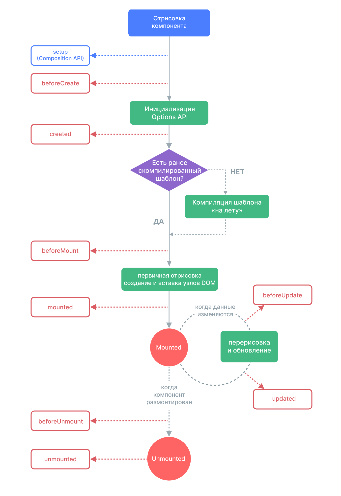

# Хуки жизненного цикла {#lifecycle-hooks}

Каждый экземпляр компонента Vue при создании проходит ряд шагов инициализации — например, ему необходимо настроить наблюдение за данными, скомпилировать шаблон, подключить экземпляр к DOM и обновить DOM при изменении данных. По пути он также запускает функции, называемые «хуками жизненного цикла», давая пользователям возможность добавлять свой собственный код на определенных этапах.

## Регистрация хуков жизненного цикла {#registering-lifecycle-hooks}

Например, хук <span class="composition-api">`onMounted`</span><span class="options-api">`mounted`</span> можно использовать для запуска кода после того, как компонент завершит начальную отрисовку и создаст узлы DOM:

<div class="composition-api">

```vue
<script setup>
import { onMounted } from 'vue'

onMounted(() => {
  console.log(`компонент смонтирован.`)
})
</script>
```

</div>
<div class="options-api">

```js
export default {
  mounted() {
    console.log(`компонент смонтирован.`)
  }
}
```

</div>

Существуют также другие хуки, которые будут вызываться на разных этапах жизненного цикла экземпляра, наиболее часто используемыми являются <span class="composition-api">[`onMounted`](/api/composition-api-lifecycle#onmounted), [`onUpdated`](/api/composition-api-lifecycle#onupdated) и [`onUnmounted`](/api/composition-api-lifecycle#onunmounted).</span><span class="options-api ">[`mounted`](/api/options-lifecycle#mounted), [`updated`](/api/options-lifecycle#updated) и [`unmounted`](/api/options-lifecycle#unmounted).</span>

<div class="options-api">

Все хуки жизненного цикла вызываются с контекстом `this`, указывающим на текущий активный экземпляр, вызывающий хук. Обратите внимание, что при объявлении хуков жизненного цикла следует избегать использования стрелочных функций, так как в этом случае вы не сможете получить доступ к экземпляру компонента через `this`.

</div>

<div class="composition-api">

При вызове `onMounted` Vue автоматически связывает зарегистрированную функцию обратного вызова с текущим активным экземпляром компонента. Это требует, чтобы эти хуки были зарегистрированы **синхронно** во время установки компонента. Например, не делайте этого:

```js
setTimeout(() => {
  onMounted(() => {
    // это не сработает.
  })
}, 100)
```

Обратите внимание, что это не означает, что вызов должен быть помещен лексически внутри `setup()` или `<script setup>`. `onMounted()` может быть вызвана во внешней функции, если стек вызовов является синхронным и происходит изнутри `setup()`.

</div>

## Диаграмма жизненного цикла {#lifecycle-diagram}

Ниже приведена диаграмма жизненного цикла экземпляра. Вам не нужно полностью понимать всё, что происходит сейчас, но по мере изучения и создания новых объектов это будет полезным справочником.



<!-- https://www.figma.com/file/Xw3UeNMOralY6NV7gSjWdS/Vue-Lifecycle -->

Обратитесь к <span class="composition-api">[Справочнику по API хуков жизненного цикла](/api/composition-api-lifecycle)</span><span class="options-api">[Справочнику по API хуков жизненного цикла](/api/options-lifecycle)</span> для получения подробной информации обо всех хуках жизненного цикла и их соответствующих случаях использования.
