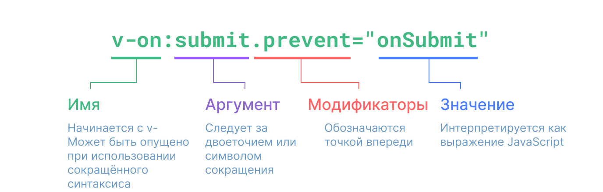

# Синтаксис шаблонов {#template-syntax}

<ScrimbaLink href="https://scrimba.com/links/vue-template-syntax" title="Бесплатный урок по синтаксису шаблонов в Vue.js" type="scrimba">
  Посмотрите интерактивный видео-урок на Scrimba
</ScrimbaLink>

Vue использует синтаксис шаблонов на основе HTML, который позволяет вам декларативно привязывать отрисованную DOM к данным базового экземпляра компонента. Все шаблоны Vue представляют собой синтаксически валидный HTML, который может быть разобран браузерами и HTML-парсерами, соответствующими спецификации.

Под капотом Vue компилирует шаблоны в высокооптимизированный код JavaScript. В сочетании с системой реактивности Vue может интеллектуально определять минимальное количество компонентов для повторного отображения и применять минимальное количество манипуляций с DOM при изменении состояния приложения.

Если вы знакомы с концепциями Virtual DOM и предпочитаете сырую мощь JavaScript, вы также можете [напрямую писать функции отрисовки](/guide/extras/render-function) вместо шаблонов, с дополнительной поддержкой JSX. Однако следует учитывать, что они не обладают тем же уровнем оптимизации при компиляции, как шаблоны.

## Интерполяция текста {#text-interpolation}

Самой простой формой привязки данных является интерполяция текста с помощью синтаксиса «усов» (двойные фигурные скобки):

```vue-html
<span>Сообщение: {{ msg }}</span>
```

Выражение `{{ msg }}` будет заменено на значение свойства `msg` [из соответствующего экземпляра компонента](/guide/essentials/reactivity-fundamentals#declaring-reactive-state). Он также будет обновляться при изменении свойства `msg`.

## Необработанный HTML {#raw-html}

Двойные усы интерпретируют данные как обычный текст, а не HTML. Чтобы вывести настоящий HTML, необходимо использовать директиву [`v-html`](/api/built-in-directives#v-html):

```vue-html
<p>Использование интерполяции текста: {{ rawHtml }}</p>
<p>Использование директивы v-html: <span v-html="rawHtml"></span></p>
```

<script setup>
  const rawHtml = '<span style="color: red">Это должно быть красным.</span>'
</script>

<div class="demo">
  <p>Использование интерполяции текста: {{ rawHtml }}</p>
  <p>Использование директивы v-html: <span v-html="rawHtml"></span></p>
</div>

Здесь мы сталкиваемся с чем-то новым. Атрибут `v-html`, который вы видите, называется **директивой**. Директивы имеют префикс `v-`, чтобы указать, что они являются специальными атрибутами, предоставляемыми Vue, и, как вы уже догадались, они применяют специальное реактивное поведение к отрисовке DOM. Здесь мы, по сути, говорим «обновляйте внутренний HTML этого элемента с помощью свойства `rawHtml` текущего активного экземпляра».

Содержимое `span` будет заменено значением свойства `rawHtml`, интерпретируемым как обычный HTML — привязки данных игнорируются. Обратите внимание, что вы не можете использовать `v-html` для составления частей шаблонов, поскольку Vue не является шаблонизатором на основе строк. Вместо этого предпочтение отдается компонентам как основополагающей единице для повторного использования и создания пользовательского интерфейса.

:::warning Предупреждение безопасности
Динамическая отрисовка произвольного HTML на вашем сайте может быть очень опасен, поскольку легко может привести к [XSS-уязвимости](https://ru.wikipedia.org/wiki/%D0%9C%D0%B5%D0%B6%D1%81%D0%B0%D0%B9%D1%82%D0%BE%D0%B2%D1%8B%D0%B9_%D1%81%D0%BA%D1%80%D0%B8%D0%BF%D1%82%D0%B8%D0%BD%D0%B3). Используйте `v-html` только для доверенного содержимого и **никогда** для содержимого, предоставленного пользователем.
:::

## Привязка атрибутов {#attribute-bindings}

Усы нельзя использовать внутри атрибутов HTML. Вместо этого используйте директиву [`v-bind`](/api/built-in-directives#v-bind):

```vue-html
<div v-bind:id="dynamicId"></div>
```

Директива `v-bind` указывает Vue поддерживать атрибут `id` элемента в синхронизации со свойством `dynamicId` компонента. Если связанное значение равно `null` или `undefined`, то атрибут будет удалён из отображаемого элемента.

### Сокращённый синтаксис {#shorthand}

Поскольку `v-bind` используется так часто, для него разработан специальный сокращённый синтаксис:

```vue-html
<div :id="dynamicId"></div>
```

Атрибуты, начинающиеся с `:`, могут выглядеть несколько иначе, чем в обычном HTML, но на самом деле это допустимый символ для имён атрибутов, и все браузеры, поддерживающие Vue, могут правильно его разобрать. Кроме того, они не отображаются в конечной разметке. Сокращённый синтаксис необязателен, но вы, вероятно, оцените его, когда узнаете больше о его использовании позже.

> В оставшейся части руководства мы будем использовать сокращённый синтаксис в примерах кода, так как это наиболее распространённое использование для разработчиков Vue.

### Одноимённое сокращение {#same-name-shorthand}

- Поддерживается только в версии 3.4+

Если атрибут имеет то же имя, что и переменная JavaScript, к которой происходит привязка, синтаксис можно дополнительно сократить, опустив значение атрибута:

```vue-html
<!-- same as :id="id" -->
<div :id></div>

<!-- this also works -->
<div v-bind:id></div>
```

Это похоже на синтаксис сокращения свойств при объявлении объектов в JavaScript. Обратите внимание, что эта функция доступна только в Vue 3.4 и выше.

### Атрибуты с булевым значением {#boolean-attributes}

[Булевы атрибуты](https://html.spec.whatwg.org/multipage/common-microsyntaxes.html#boolean-attributes) — это атрибуты, которые своим присутствием в элементе могут указывать на истинное или ложное значение. Например, [`disabled`](https://developer.mozilla.org/en-US/docs/Web/HTML/Attributes/disabled) — один из наиболее часто используемых булевых атрибутов.

В этом случае `v-bind` работает немного по-другому:

```vue-html
<button :disabled="isButtonDisabled">Кнопка</button>
```

Атрибут `disabled` будет включен, если `isButtonDisabled` имеет [истинноподобное значение](https://developer.mozilla.org/ru/docs/Glossary/Truthy). Он также будет включен, если значение является пустой строкой, что обеспечивает согласованность с `<button disabled="">`. Для других [ложноподобных значений](https://developer.mozilla.org/ru/docs/Glossary/Falsy) атрибут будет опущен.

### Динамическое связывание нескольких атрибутов {#dynamically-binding-multiple-attributes}

Если у вас есть объект JavaScript, представляющий несколько атрибутов, он выглядит следующим образом:

<div class="composition-api">

```js
const objectOfAttrs = {
  id: 'container',
  class: 'wrapper',
  style: 'background-color:green'
}
```

</div>
<div class="options-api">

```js
data() {
  return {
    objectOfAttrs: {
      id: 'container',
      class: 'wrapper'
    }
  }
}
```

</div>

Вы можете привязать их к одному элементу, используя `v-bind` без аргумента:

```vue-html
<div v-bind="objectOfAttrs"></div>
```

## Использование выражений JavaScript {#using-javascript-expressions}

До сих пор мы привязывали только простые ключи свойств в наших шаблонах. Но Vue на самом деле поддерживает всю мощь выражений JavaScript внутри всех привязок данных:

```vue-html
{{ number + 1 }}

{{ ok ? 'ДА' : 'НЕТ' }}

{{ message.split('').reverse().join('') }}

<div :id="`list-${id}`"></div>
```

Эти выражения будут анализироваться как JavaScript в области данных текущего экземпляра компонента.

В шаблонах Vue выражения JavaScript можно использовать в следующих позициях:

- Внутритекстовые интерполяции (усы)
- В значении атрибутов любых директив Vue (специальные атрибуты, начинающиеся с `v-`)

### Только выражения {#expressions-only}

Каждая привязка может содержать только **одно единственное выражение**. Выражение — это часть кода, которая может быть оценена в значение. Простая проверка заключается в том, можно ли его использовать после `return`.

Поэтому следующие варианты **НЕ** будут работать:

```vue-html
<!-- это утверждение, а не выражение: -->
{{ var a = 1 }}

<!-- управление потоком тоже не работает, используйте тернарные выражения -->
{{ if (ok) { return message } }}
```

### Вызов функций {#calling-functions}

Можно вызвать метод, раскрытый компонентом, внутри выражения привязки:

```vue-html
<time :title="toTitleDate(date)" :datetime="date">
  {{ formatDate(date) }}
</time>
```

:::tip Примечание
Функции, вызываемые внутри выражений привязки, будут вызываться каждый раз при обновлении компонента, поэтому они **не** должны иметь никаких побочных эффектов, таких как изменение данных или запуск асинхронных операций.
:::

### Ограниченный доступ к глобальным переменным {#restricted-globals-access}

Шаблонные выражения находятся в «песочнице» и имеют доступ только к [ограниченному списку глобальных значений](https://github.com/vuejs/core/blob/main/packages/shared/src/globalsAllowList.ts#L3). В списке представлены часто используемые встроенные глобальные таблицы, такие как `Math` и `Date`.

Глобалы, не включенные в список явно, например, пользовательские свойства `window`, не будут доступны в выражениях шаблона. Однако вы можете явно определить дополнительные глобалы для всех выражений Vue, добавив их в [`app.config.globalProperties`](/api/application#app-config-globalproperties).

## Директивы {#directives}

Директивы — это специальные атрибуты с префиксом `v-`. Vue предоставляет ряд [встроенных директив](/api/built-in-directives), включая `v-html` и `v-bind`, которые мы представили выше.

Значения атрибутов директив должны быть одиночными выражениями JavaScript (за исключением `v-for`, `v-on` и `v-slot`, которые будут рассмотрены в соответствующих разделах позже). Задача директивы — реактивно применять обновления к DOM при изменении значения её выражения. В качестве примера можно взять [`v-if`](/api/built-in-directives#v-if):

```vue-html
<p v-if="seen">Теперь вы меня видите</p>
```

Здесь директива `v-if` будет удалять или вставлять элемент `<p>` в зависимости от истинности значения выражения `seen`.

### Аргументы {#arguments}

Некоторые директивы могут принимать «аргумент», обозначаемый двоеточием после имени директивы. Например, директива `v-bind` используется для реактивного обновления HTML-атрибута:

```vue-html
<a v-bind:href="url"> ... </a>

<!-- короткий синтаксис -->
<a :href="url"> ... </a>
```

Здесь `href` — аргумент, который указывает директиве `v-bind` связать атрибут `href` элемента со значением выражения `url`. В сокращении всё, что находится перед аргументом (т. е. `v-bind:`), сжимается до одного символа, `:`.

Другой пример — директива `v-on`, которая прослушивает события DOM:

```vue-html
<a v-on:click="doSomething"> ... </a>

<!-- короткий синтаксис -->
<a @click="doSomething"> ... </a>
```

Здесь аргументом является имя события, которое нужно прослушать: `click`. У `v-on` есть соответствующее сокращение, а именно символ `@`. Мы также поговорим об обработке событий более подробно.

### Динамические аргументы {#dynamic-arguments}

Также можно использовать выражение JavaScript в аргументе директивы, обернув его квадратными скобками:

```vue-html
<!--
Обратите внимание, что на выражение аргумента накладываются некоторые ограничения, как объясняется в разделах
«Динамические ограничения значений аргументов» и «Динамические ограничения синтаксиса аргументов».
-->
<a v-bind:[attributeName]="url"> ... </a>

<!-- короткий синтаксис -->
<a :[attributeName]="url"> ... </a>
```

Здесь `attributeName` будет динамически проанализирован как выражение JavaScript, и его итоговое значение будет использовано в качестве окончательного значения аргумента. Например, если у экземпляра вашего компонента есть свойство данных `attributeName`, значение которого равно `"href"`, то эта привязка будет эквивалентна `v-bind:href`.

Аналогично, вы можете использовать динамические аргументы для привязки обработчика к динамическому имени события:

```vue-html
<a v-on:[eventName]="doSomething"> ... </a>

<!-- короткий синтаксис -->
<a @[eventName]="doSomething">
```

В этом примере, когда значение `eventName` равно `"focus"`, `v-on:[eventName]` будет эквивалентно `v-on:focus`.

#### Динамические ограничения значений аргументов {#dynamic-argument-value-constraints}

Динамические аргументы, за исключением `null`, должны быть проанализированы в строку. Специальное значение `null` может быть использовано для явного удаления привязки. Любое другое нестроковое значение вызовет предупреждение.

#### Динамические ограничения синтаксиса аргументов {#dynamic-argument-syntax-constraints}

Выражения динамических аргументов имеют некоторые синтаксические ограничения, поскольку некоторые символы, такие как пробелы и кавычки, недопустимы в именах атрибутов HTML. Например, следующее недействительно:

```vue-html
<!-- Это вызовет предупреждение компилятора. -->
<a :['foo' + bar]="value"> ... </a>
```

Если вам нужно передать сложный динамический аргумент, лучше использовать [вычисляемое свойство](./computed), о котором мы расскажем в ближайшее время.

При использовании шаблонов в DOM (шаблонов, непосредственно записанных в HTML-файл) также следует избегать именования ключей заглавными символами, поскольку браузеры принудительно переводят имена атрибутов в нижний регистр:

```vue-html
<a :[someAttr]="value"> ... </a>
```

Вышеуказанное будет преобразовано в `:[someattr]` в шаблонах в DOM. Если ваш компонент имеет свойство `someAttr` вместо `someattr`, ваш код не будет работать. Шаблоны внутри однофайловых компонентов **не** подвержены этому ограничению.

### Модификаторы {#modifiers}

Модификаторы — это специальные постфиксы, обозначаемые точкой, которые указывают на то, что директива должна быть связана каким-то особым образом. Например, модификатор `.prevent` указывает директиве `v-on` вызвать `event.preventDefault()` на сработавшем событии:

```vue-html
<form @submit.prevent="onSubmit">...</form>
```

Другие примеры модификаторов вы увидите позже, [для `v-on`](./event-handling#event-modifiers) и [для `v-model`](./forms#modifiers), когда мы будем изучать эти возможности.

И, наконец, вот визуализированный полный синтаксис директивы:



<!-- https://www.figma.com/file/BGWUknIrtY9HOmbmad0vFr/Directive -->
