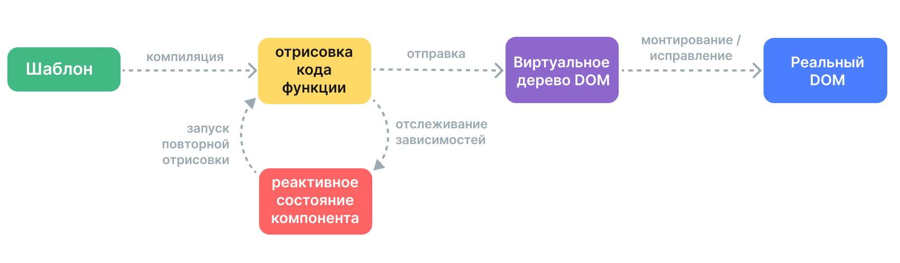

# Механизм отрисовки {#rendering-mechanism}

Как Vue берет шаблон и превращает его в фактические узлы DOM? Как Vue эффективно обновляет эти узлы DOM? Мы попытаемся пролить свет на эти вопросы, погрузившись во внутренний механизм отрисовки Vue.

## Virtual DOM {#virtual-dom}

Вы наверняка слышали о термине «Virtual DOM», на котором основана система отрисовки Vue.

Виртуальный DOM (VDOM) — это концепция программирования, в которой идеальное, или «виртуальное», представление пользовательского интерфейса хранится в памяти и синхронизируется с «реальным» DOM. Эта концепция была впервые применена в [React](https://reactjs.org/), а затем была принята во многих других фреймворках с различными реализациями, включая Vue.

Виртуальный DOM — это скорее шаблон, чем конкретная технология, поэтому канонической реализации не существует. Мы можем проиллюстрировать эту идею на простом примере:

```js
const vnode = {
  type: 'div',
  props: {
    id: 'hello'
  },
  children: [
    /* больше виртуальных узлов */
  ]
}
```

Здесь `vnode` — это обычный объект JavaScript («виртуальный узел»), представляющий элемент `<div>`. В нем содержится вся информация, необходимая для создания самого элемента. Он также содержит больше дочерних узлов, что делает его корневым узлом виртуального дерева DOM.

Рендерер во время выполнения может перемещаться по виртуальному DOM-дереву и строить из него реальное DOM-дерево. Этот процесс называется **mount**.

Если у нас есть две копии виртуальных деревьев DOM, рендерер также может просмотреть и сравнить два дерева, выявляя различия, и применить эти изменения к реальному DOM. Этот процесс называется **исправлением**, он также известен как «различение» или «согласование».

Основное преимущество Virtual DOM заключается в том, что он дает разработчику возможность программно создавать, проверять и компоновать желаемые структуры пользовательского интерфейса декларативным способом, оставляя непосредственную работу с DOM рендереру.

## Конвейер отрисовки {#render-pipeline}

На высоком уровне это то, что происходит, когда монтируется компонент Vue:

1. **Компиляция**: шаблоны Vue компилируются в **рендер-функции**: функции, которые возвращают виртуальные деревья DOM. Этот шаг можно выполнить либо заранее на этапе сборки, либо «на лету» с помощью компилятора среды выполнения.

2. **Монтирование**: средство визуализации во время выполнения вызывает рендер-функции, просматривает возвращённое виртуальное дерево DOM и создает на его основе фактические узлы DOM. Этот шаг выполняется как [реактивный эффект](./reactivity-in-depth), поэтому он отслеживает все использованные реактивные зависимости.

3. **Патч**: при изменении зависимости, используемой во время монтирования, эффект запускается повторно. На этот раз создается новое, обновлённое дерево Virtual DOM. Средство визуализации во время выполнения просматривает новое дерево, сравнивает его со старым и применяет необходимые обновления к фактическому DOM.



<!-- https://www.figma.com/file/elViLsnxGJ9lsQVsuhwqxM/Rendering-Mechanism -->

## Шаблоны против рендер-функций {#templates-vs-render-functions}

Шаблоны Vue компилируются в виртуальные рендер-функции DOM. Vue также предоставляет API, которые позволяют нам пропустить этап компиляции шаблона и напрямую авторизовать рендер-функции. Рендер-функции более гибкие, чем шаблоны, когда речь идёт о высокодинамичной логике, потому что вы можете работать с виртуальными узлами, используя всю мощь JavaScript.

Почему же Vue по умолчанию рекомендует шаблоны? На это есть несколько причин:

1. Шаблоны ближе к реальному HTML. Это облегчает повторное использование существующих HTML-сниппетов, применение лучших практик доступности, стилизацию с помощью CSS, а также понимание и модификацию дизайнерами.

2. Шаблоны легче поддаются статистическому анализу благодаря их более детерминированному синтаксису. Это позволяет компилятору шаблонов Vue применять множество оптимизаций во время компиляции для повышения производительности Virtual DOM (о чём мы поговорим ниже).

На практике шаблонов достаточно для большинства случаев использования в приложениях. Рендер-функции обычно используются только в многократно используемых компонентах, которые должны иметь дело с высокодинамичной логикой отрисовки. Более подробно использование рендер-функций рассматривается в главе [Рендер-функции и JSX](./render-function).

## Virtual DOM на основе данных компилятора {#compiler-informed-virtual-dom}

Реализация Virtual DOM в React и большинство других реализаций Virtual DOM являются чисто исполнительными: алгоритм согласования не может делать никаких предположений о входящем виртуальном DOM-дереве, поэтому для обеспечения корректности он должен полностью обойти дерево и продифференцировать параметры каждого виртуального узла. Кроме того, даже если часть дерева никогда не меняется, для нее всегда создаются новые узлы при каждой повторной отрисовке, что приводит к излишней нагрузке на память. Это один из самых критикуемых аспектов Virtual DOM: в процессе примирения, осуществляемого несколько грубовато, эффективность приносится в жертву декларативности и корректности.

Но так не должно быть. В Vue фреймворк контролирует как компилятор, так и среду выполнения. Это позволяет нам реализовать множество оптимизаций времени компиляции, которыми может воспользоваться только тесно связанный рендерер. Компилятор может статически анализировать шаблон и оставлять подсказки в сгенерированном коде, чтобы среда выполнения могла использовать ярлыки, когда это возможно. В то же время мы по-прежнему сохраняем возможность пользователю перейти на уровень рендер-функции для более прямого управления в крайних случаях. Мы называем этот гибридный подход **Виртуальным DOM, основанным на компиляторе**.

Ниже мы рассмотрим несколько основных оптимизаций, сделанных компилятором шаблонов Vue для повышения производительности Virtual DOM во время выполнения.

### Кэширование статики {#cache-static}

Довольно часто в шаблоне встречаются части, не содержащие каких-либо динамических привязок:

```vue-html{2-3}
<div>
  <div>foo</div> <!-- cached -->
  <div>bar</div> <!-- cached -->
  <div>{{ dynamic }}</div>
</div>
```

[Инспектировать в проводнике шаблонов](https://template-explorer.vuejs.org/#eyJzcmMiOiI8ZGl2PlxuICA8ZGl2PmZvbzwvZGl2PiA8IS0tIGNhY2hlZCAtLT5cbiAgPGRpdj5iYXI8L2Rpdj4gPCEtLSBjYWNoZWQgLS0+XG4gIDxkaXY+e3sgZHluYW1pYyB9fTwvZGl2PlxuPC9kaXY+XG4iLCJvcHRpb25zIjp7ImhvaXN0U3RhdGljIjp0cnVlfX0=)

Элементы div `foo` и `bar` статичны — повторное создание узлов и их сравнение при каждой повторной отрисовке не требуется. Рендерер создает эти узлы во время первоначального рендеринга, кэширует их и повторно использует те же узлы для каждой последующей повторной отрисовки. Средство визуализации также может полностью пропустить их различие, когда заметит, что старый и новый узлы совпадают.

Кроме того, если имеется достаточное количество последовательных статических элементов, они будут сжаты в один «статический узел», который содержит простую строку HTML для всех этих узлов ([Пример](https://template-explorer.vuejs.org/#eyJzcmMiOiI8ZGl2PlxuICA8ZGl2IGNsYXNzPVwiZm9vXCI+Zm9vPC9kaXY+XG4gIDxkaXYgY2xhc3M9XCJmb29cIj5mb288L2Rpdj5cbiAgPGRpdiBjbGFzcz1cImZvb1wiPmZvbzwvZGl2PlxuICA8ZGl2IGNsYXNzPVwiZm9vXCI+Zm9vPC9kaXY+XG4gIDxkaXYgY2xhc3M9XCJmb29cIj5mb288L2Rpdj5cbiAgPGRpdj57eyBkeW5hbWljIH19PC9kaXY+XG48L2Rpdj4iLCJzc3IiOmZhbHNlLCJvcHRpb25zIjp7ImhvaXN0U3RhdGljIjp0cnVlfX0=)). Эти статические узлы монтируются путём непосредственной установки `innerHTML`.

### Флаги исправлений {#patch-flags}

Для одного элемента с динамическими привязками мы также можем получить из него много информации во время компиляции:

```vue-html
<!-- только привязка к классу -->
<div :class="{ active }"></div>

<!-- только привязки к идентификаторам и значениям -->
<input :id="id" :value="value">

<!-- только текстовые дочерние элементы -->
<div>{{ dynamic }}</div>
```

[Инспектировать в проводнике шаблонов](https://template-explorer.vuejs.org/#eyJzcmMiOiI8ZGl2IDpjbGFzcz1cInsgYWN0aXZlIH1cIj48L2Rpdj5cblxuPGlucHV0IDppZD1cImlkXCIgOnZhbHVlPVwidmFsdWVcIj5cblxuPGRpdj57eyBkeW5hbWljIH19PC9kaXY+Iiwib3B0aW9ucyI6e319)

При генерации кода рендер-функции для этих элементов Vue кодирует тип обновления, который требуется каждому из них, непосредственно в вызове создания узла:

```js{3}
createElementVNode("div", {
  class: _normalizeClass({ active: _ctx.active })
}, null, 2 /* CLASS */)
```

Последний аргумент, `2`, представляет собой [флаг патча](https://github.com/vuejs/core/blob/main/packages/shared/src/patchFlags.ts). Элемент может иметь несколько флагов патча, которые будут объединены в одно число. Рендерер во время выполнения может проверить флаги с помощью [битовых операций](https://en.wikipedia.org/wiki/Bitwise_operation), чтобы определить, нужно ли ему выполнять определённую работу:

```js
if (vnode.patchFlag & PatchFlags.CLASS /* 2 */) {
  // обновляем класс элемента
}
```

Побитовые проверки чрезвычайно быстры. С помощью флагов патча Vue может выполнять минимальный объём работы при обновлении элементов с динамическими привязками.

Vue также кодирует тип дочерних элементов, которые есть у узла. Например, шаблон, имеющий несколько корневых узлов, представляется в виде фрагмента. В большинстве случаев мы точно знаем, что порядок этих корневых узлов никогда не изменится, поэтому эту информацию также можно передать во время выполнения в качестве флага патча:

```js{4}
export function render() {
  return (_openBlock(), _createElementBlock(_Fragment, null, [
    /* потомки */
  ], 64 /* STABLE_FRAGMENT */))
}
```

Таким образом, время выполнения может полностью пропустить согласование дочерних порядков для корневого фрагмента.

### Выравнивание деревьев {#tree-flattening}

Если ещё раз взглянуть на сгенерированный код из предыдущего примера, то можно заметить, что корневой узел возвращаемого виртуального DOM-дерева создается с помощью специального вызова `createElementBlock()`:

```js{2}
export function render() {
  return (_openBlock(), _createElementBlock(_Fragment, null, [
    /* потомки */
  ], 64 /* STABLE_FRAGMENT */))
}
```

Концептуально, «блок» это часть шаблона, которая имеет стабильную внутреннюю структуру. В данном случае весь шаблон состоит из одного блока, поскольку не содержит структурных директив типа `v-if` и `v-for`.

Каждый блок отслеживает все узлы-потомки (не только прямые дочерние), имеющие флаги исправлений. Например:

```vue-html{3,5}
<div> <!-- корневой блок -->
  <div>...</div>         <!-- не отслеживается -->
  <div :id="id"></div>   <!-- отслеживается -->
  <div>                  <!-- не отслеживается -->
    <div>{{ bar }}</div> <!-- отслеживается -->
  </div>
</div>
```

В результате получается сглаженный массив, содержащий только динамические узлы-потомки:

```
div (корневой блок)
- div с привязкой :id
- div с привязкой {{ bar }}
```

Когда этому компоненту нужно переснять изображение, ему нужно обойти только сплющенное дерево, а не всё дерево. Это называется **Выравниванием деревьев**, и это значительно сокращает количество узлов, которые необходимо обойти при сверке Virtual DOM. Все статические части шаблона фактически пропускаются.

Директивы `v-if` и `v-for` создают новые узлы блока:

```vue-html
<div> <!-- корневой блок -->
  <div>
    <div v-if> <!-- блок if -->
      ...
    </div>
  </div>
</div>
```

Дочерний блок отслеживается внутри массива динамических потомков родительского блока. Это сохраняет стабильную структуру родительского блока.

### Влияние на гидратацию SSR {#impact-on-ssr-hydration}

И флаги исправлений, и выравнивание дерева также значительно улучшают производительность [гидратации SSR](/guide/scaling-up/ssr#client-hydration):

- Гидратация одного элемента может осуществляться быстрыми способами на основе соответствующего флага исправления vnode.

- Во время гидратации необходимо проходить только узлы блоков и их динамические потомки, эффективно достигая частичной гидратации на уровне шаблона.
