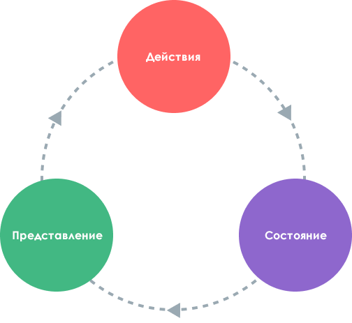

# Управление состоянием {#state-management}

## Что это такое? {#what-is-state-management}

Технически, каждый экземпляр компонента Vue уже «управляет» своим собственным реактивным состоянием. В качестве примера возьмем простой компонент счётчика:

<div class="composition-api">

```vue
<script setup>
import { ref } from 'vue'

// состояние
const count = ref(0)

// действия
function increment() {
  count.value++
}
</script>

<!-- представление -->
<template>{{ count }}</template>
```

</div>
<div class="options-api">

```vue
<script>
export default {
  // состояние
  data() {
    return {
      count: 0
    }
  },
  // действия
  methods: {
    increment() {
      this.count++
    }
  }
}
</script>

<!-- представление -->
<template>{{ count }}</template>
```

</div>

Это автономный блок, состоящий из следующих частей:

- **Состояниеe**, источник истины, который управляет нашим приложением;
- **Представление**, декларативное отображение **состояния**;
- **Действия**, возможные способы изменения состояния в ответ на пользовательский ввод из **представления**.

Это простое представление концепции «одностороннего потока данных»:

<p style="text-align: center">
  
</p>

Однако простота начинает разрушаться, когда у нас есть **множество компонентов, имеющих общее состояние**:

1. Несколько представлений могут зависеть от одного и того же фрагмента состояния.
2. Действиям из разных представлений может потребоваться мутировать один и тот же фрагмент состояния.

В первом случае возможным обходным путём является «поднятие» общего состояния до общего компонента-предка, а затем передавать его вниз в виде параметров. Однако это быстро становится утомительным в деревьях компонентов с глубокой иерархией, что приводит к другой проблеме, известной как [сквозная передача параметров](/guide/components/provide-inject#prop-drilling).

Во втором случае мы часто прибегаем к таким решениям, как поиск прямых родительских и дочерних экземпляров с помощью шаблонных ссылок или попытка мутировать и синхронизировать несколько копий состояния с помощью испускаемых событий. Оба этих паттерна хрупки и быстро приводят к появлению не поддерживаемого кода.

Более простым и понятным решением является извлечение общего состояния из компонентов и управление им в глобальном синглтоне. Таким образом, наше дерево компонентов превращается в большое «представление», и любой компонент может получить доступ к состоянию или вызвать действия, независимо от того, где он находится в дереве!

## Простое управление состоянием с помощью Reactivity API {#simple-state-management-with-reactivity-api}

<div class="options-api">

В API Options реактивные данные объявляются с помощью опции `data()`. Внутренне объект, возвращаемый `data()`, становится реактивным с помощью функции [`reactive()`](/api/reactivity-core#reactive), которая также доступна в виде публичного API.

</div>

Если у вас есть часть состояния, которая должна быть общей для нескольких экземпляров, вы можете использовать [`reactive()`](/api/reactivity-core#reactive) для создания реактивного объекта, а затем импортировать его в несколько компонентов:

```js
// store.js
import { reactive } from 'vue'

export const store = reactive({
  count: 0
})
```

<div class="composition-api">

```vue
<!-- ComponentA.vue -->
<script setup>
import { store } from './store.js'
</script>

<template>Из A: {{ store.count }}</template>
```

```vue
<!-- ComponentB.vue -->
<script setup>
import { store } from './store.js'
</script>

<template>Из B: {{ store.count }}</template>
```

</div>
<div class="options-api">

```vue
<!-- ComponentA.vue -->
<script>
import { store } from './store.js'

export default {
  data() {
    return {
      store
    }
  }
}
</script>

<template>Из A: {{ store.count }}</template>
```

```vue
<!-- ComponentB.vue -->
<script>
import { store } from './store.js'

export default {
  data() {
    return {
      store
    }
  }
}
</script>

<template>Из B: {{ store.count }}</template>
```

</div>

Теперь при каждом изменении объекта `store` и `<ComponentA>`, и `<ComponentB>` будут автоматически обновлять свои представления - у нас теперь есть единый источник истины.

Однако это также означает, что любой компонент, импортирующий `store`, может изменять его по своему усмотрению:

```vue-html{2}
<template>
  <button @click="store.count++">
    Из B: {{ store.count }}
  </button>
</template>
```

Хотя в простых случаях это работает, глобальное состояние, которое может произвольно изменяться любым компонентом, в долгосрочной перспективе будет не очень удобным для обслуживания. Чтобы логика изменения состояния была централизованной, как и само состояние, рекомендуется определять методы в хранилище с именами, выражающими намерение действий:

```js{6-8}
// store.js
import { reactive } from 'vue'

export const store = reactive({
  count: 0,
  increment() {
    this.count++
  }
})
```

```vue-html{2}
<template>
  <button @click="store.increment()">
    Из B: {{ store.count }}
  </button>
</template>
```

<div class="composition-api">

[Попробовать в Песочнице](https://play.vuejs.org/#eNrNkk1uwyAQha8yYpNEiUzXllPVrtRTeJNSqtLGgGBsVbK4ewdwnT9FWWSTFczwmPc+xMhqa4uhl6xklRdOWQQvsbfPrVadNQ7h1dCqpcYaPp3pYFHwQyteXVxKm0tpM0krnm3IgAqUnd3vUFIFUB1Z8bNOkzoVny+wDTuNcZ1gBI/GSQhzqlQX3/5Gng81pA1t33tEo+FF7JX42bYsT1BaONlRguWqZZMU4C261CWMk3EhTK8RQphm8Twse/BscoUsvdqDkTX3kP3nI6aZwcmdQDUcMPJPabX8TQphtCf0RLqd1csxuqQAJTxtYnEUGtIpAH4pn1Ou17FDScOKhT+QNAVM)

</div>
<div class="options-api">

[Попробовать в Песочнице](https://play.vuejs.org/#eNrdU8FqhDAU/JVHLruyi+lZ3FIt9Cu82JilaTWR5CkF8d8bE5O1u1so9FYQzAyTvJnRTKTo+3QcOMlIbpgWPT5WUnS90gjPyr4ll1jAWasOdim9UMum3a20vJWWqxSgkvzTyRt+rocWYVpYFoQm8wRsJh+viHLBcyXtk9No2ALkXd/WyC0CyDfW6RVTOiancQM5ku+x7nUxgUGlOcwxn8Ppu7HJ7udqaqz3SYikOQ5aBgT+OA9slt9kasToFnb5OiAqCU+sFezjVBHvRUimeWdT7JOKrFKAl8VvYatdI6RMDRJhdlPtWdQf5mdQP+SHdtyX/IftlH9pJyS1vcQ2NK8ZivFSiL8BsQmmpMG1s1NU79frYA1k8OD+/I3pUA6+CeNdHg6hmoTMX9pPSnk=)

</div>

:::tip Примечание
Обратите внимание, что в обработчике клика используется `store.increment()` со скобками - это необходимо для вызова метода с правильным контекстом `this`, поскольку это не метод компонента.
:::

Хотя здесь мы используем один реактивный объект в качестве хранилища, вы также можете делиться реактивным состоянием, созданным с помощью других [Reactivity API](/api/reactivity-core), таких как `ref()` или `computed()`, или даже возвращать глобальное состояние из A [композабла](/guide/reusability/composables):

```js
import { ref } from 'vue'

// глобальное состояние, созданное в области видимости модуля
const globalCount = ref(1)

export function useCount() {
  // локальное состояние, создаваемое для каждого компонента
  const localCount = ref(1)

  return {
    globalCount,
    localCount
  }
}
```

Тот факт, что система реактивности Vue отделена от компонентной модели, делает её чрезвычайно гибкой.

## Соображения по SSR {#ssr-considerations}

Если вы создаете приложение, использующее [рендеринг на стороне сервера (SSR)](./ssr), описанный выше паттерн может привести к проблемам, поскольку хранилище является синглтоном, разделяемым между несколькими запросами. Это обсуждается [подробнее](./ssr#cross-request-state-pollution) в руководстве по SSR.

## Pinia {#pinia}

Хотя нашего решения для управления состоянием вручную будет достаточно в простых сценариях, есть ещё много вещей, которые следует учитывать в крупномасштабных производственных приложениях:

- Более сильные соглашения для совместной работы в команде
- Интеграция с инструментами Vue DevTools, включая временную шкалу, внутрикомпонентную проверку и отладку во времени
- Замена горячего модуля
- Поддержка рендеринга на стороне сервера

[Pinia](https://pinia.vuejs.org) — это библиотека управления состояниями, которая реализует всё вышеперечисленное. Она поддерживается основной командой Vue и работает как с Vue 2, так и с Vue 3.

Бывалые пользователи могут быть знакомы с [Vuex](https://vuex.vuejs.org/), предыдущей официальной библиотекой управления состояниями для Vue. Поскольку Pinia выполняет ту же роль в экосистеме, Vuex сейчас находится в режиме обслуживания. Она по-прежнему работает, но больше не будет получать новые функции. Для новых приложений рекомендуется использовать Pinia.

Pinia начиналась как исследование того, как может выглядеть следующая итерация Vuex, вобрав в себя множество идей из обсуждений основной команды Vuex 5. В конце концов, мы поняли, что Pinia уже реализует большую часть того, что мы хотели в Vuex 5, и решили сделать её новой рекомендацией.

По сравнению с Vuex, Pinia предоставляет более простой API с меньшим количеством церемоний, предлагает API в стиле Composition API, и, что самое важное, имеет надежную поддержку вывода типов при использовании TypeScript.
